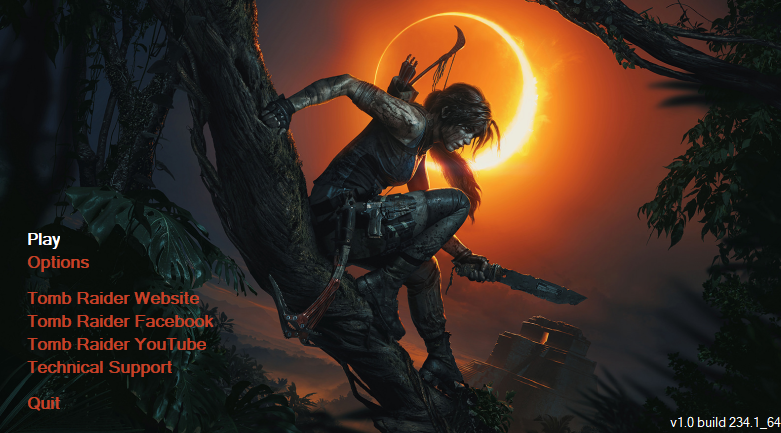
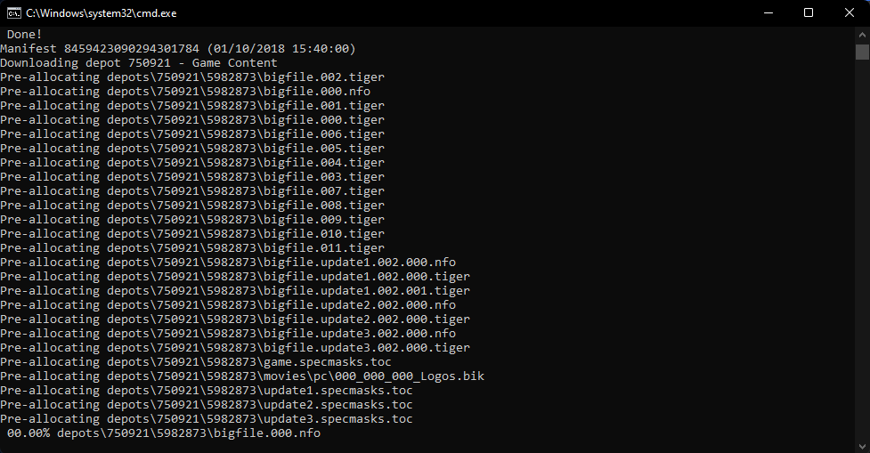

# SOTTR Downgrade Guide

Downgrade guide for Shadow of the Tomb Raider (Windows)

## Prerequisites

[Download DepotDownloader](https://github.com/SteamRE/DepotDownloader/releases/download/DepotDownloader_2.4.3/depotdownloader-2.4.3-hotfix1.zip) (Direct link)

[Download DotNet 5.0 Runtime](https://dotnet.microsoft.com/download/dotnet/thank-you/runtime-5.0.7-windows-x64-installer) (Direct link)

## Downgrading

This repository contains a `downgrade.bat` file. [Download](https://github.com/Atorizil/SOTTR-Downgrade-Guide/releases/download/v1.0/downgrade.bat) this file to where you extracted depot downloader.

*Smartscreen / Windows Defender may flag the file when you run it. It is safe so allow it to run*


Run this batch file, it will ask you for your steam username. 

### Getting Steam Username

1. In steam, click on your account in the top right and go to `Account Details`.

2. The large name that you see on that page is your steam username. *(without the 's)*

Enter this username into the batch script and press enter. 

### Downloading the Game Files

Now it will ask for your `password` and `two factor code`. *(if enabled)*

Enter these details and the script should start downloading version 234.1 of the game.

**NOTE: blue text is output from the script, it will be of interest to read**

**NOTE 2: refer to [Potential Issues](#potential-issues) if any issues arrise**

### Installation

**Optional**: Backup your game folder (Just rename it ( e.g: `Shadow of the Tomb Raider` -> `Shadow of the Tomb Raider Bak`)). Just make sure there is a `Shadow of the Tomb Raider` folder where you installed the game.
  
*You can find your game files here*


In the DepotDownloader folder, go to the folder `depots`


There should be 4 folders: `750921`, `750922`, `750924` & `792469`.

Move **all** the files in **each folder** to the game directory `Shadow of the Tomb Raider`.

Click `Yes` to overwriting the files (If you didn't backup).

### Disable DLC

Make sure you disable DLC to stop crashes:


### Preventing Updates

1. Go to your `steamapps` folder ( e.g: `C:\Program Files (x86)\Steam\steamapps` )
2. Open `appmanifest_750920.acf` in a text editor ( e.g: `notepad` )
3. Change the lines `StateFlages` and `UpdateResult` from `0` to `4`:

```
"AppState"
{
	...

	"StateFlags"		"4"
	"installdir"		"Shadow of the Tomb Raider"
	"LastUpdated"		"1619480919"
	"UpdateResult"		"4"

  ...
}
```

### Done

Launch the game and check that the version is `234.1` in the launcher:



If it is then you're done!

## Potential Issues

If you encounter any issue, try to find it here first. If this section doesn't contain your issue or doesn't fix it, ask in the `#shadow` channel in the [Tomb Runner Discord Server](https://discord.gg/011hZixyZfK5g61NL) :)

### The script seemingly freezing



Depotdownloader doesn't output until it has finished downloading a file. Some files are ~2GB so it may take some time for it to download and then update the console.

You can check for network activity in Task Manager to ensure that it is downloading.

### 'It was not possible to find any compatble framework version'

Install the [Dotnet SDK](https://dotnet.microsoft.com/download/dotnet/thank-you/sdk-5.0.204-windows-x64-installer) (Direct link) and try running the script again. 

### `Connection timeout downloading chunk XXX...'

Ignore it, Depotdownloader will reconnect and try to download it again :)
